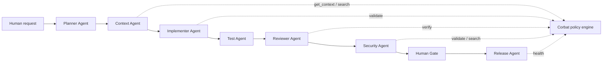

# Multi-Agent Architecture

Corbat is a standards, policy, and verification engine for agent-assisted software delivery. It does not orchestrate agents directly. It gives external agents a shared source of project standards, task guardrails, searchable knowledge, and quality gates.

## Agent Roles

| Agent | Responsibility | Corbat tools |
|-------|----------------|--------------|
| Planner Agent | Clarify scope, identify affected layers, produce implementation checklist | `get_context`, `search`, `profiles` |
| Context Agent | Resolve project stack, profile, guardrails, and relevant standards | `get_context`, `search`, resources |
| Implementer Agent | Write code and tests within project constraints | `get_context`, `validate` |
| Test Agent | Expand or repair tests and confirm behavior | `get_context`, `validate`, `search` |
| Reviewer Agent | Review implementation against policy before human handoff | `verify`, `validate`, `search` |
| Security Agent | Check secrets, unsafe APIs, input validation, and dependency posture | `verify`, `validate`, `search` |
| Release Agent | Confirm packaging, changelog, version, and release readiness | `health`, `verify`, `search` |
| Human Gate | Decide tradeoffs, approve exceptions, and merge/release | `verify` output, CI results |

## End-to-End Flow

## Recommended Workflows

### Feature Delivery

1. Planner calls `get_context` with the feature request and repository path.
2. Implementer writes tests and code using the selected profile.
3. Implementer calls `validate` during iteration.
4. Reviewer calls `verify` with implementation, tests, and interfaces.
5. Human approves remaining tradeoffs and CI results.

### Bugfix

1. Planner calls `get_context` with the bug description.
2. Test Agent creates a regression test first.
3. Implementer makes the smallest behavior-preserving fix.
4. Reviewer calls `verify` and confirms the regression test is included.

### Refactor

1. Planner calls `get_context` with task type inferred as refactor.
2. Test Agent confirms current tests pass before edits.
3. Implementer changes structure without behavior changes.
4. Reviewer calls `validate` and checks that public contracts did not drift.

### Security Fix

1. Security Agent calls `get_context` and `search` for the affected topic.
2. Implementer adds a failing security-oriented test where practical.
3. Reviewer calls `verify` and checks dependency scanning results.
4. Human approves any residual risk or documented exception.

### Dependency Upgrade

1. Planner identifies engine and package constraints.
2. Implementer upgrades without force or undocumented overrides.
3. Test Agent runs build, tests, lint, architecture validation, and audit.
4. Release Agent confirms package metadata and changelog impact.

### Release

1. Release Agent calls `health` from the packaged artifact.
2. Release Agent verifies `npm pack --dry-run` includes runtime directories.
3. Human confirms versioning, changelog, tag, and publish permissions.

## Future Orchestration Boundary

Corbat should remain the policy engine. Agent runners, queues, memory stores, and approval UIs should live outside this MCP unless there is a clear product decision to build orchestration. This keeps the MCP stable for IDEs, CLIs, and agent frameworks while leaving room for future examples and integrations.
